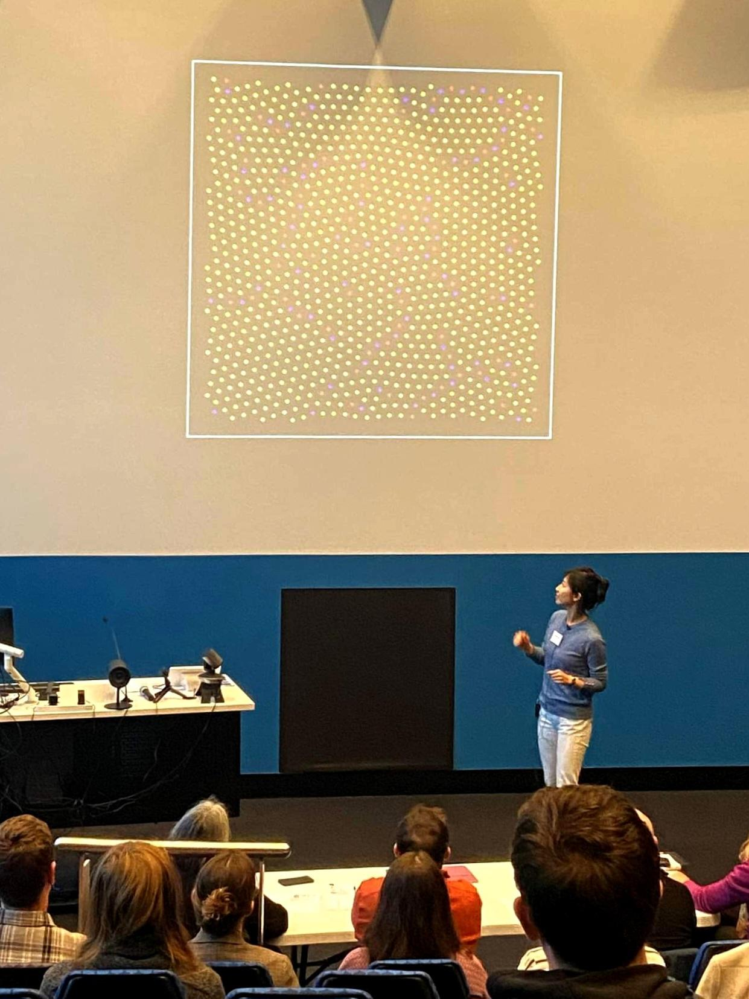

```{=html}

<div class="homepage">

<section class="home-hero">
  <div class="home-hero-inner">
    <div class="home-kicker">Mathematics · Cybernetics · Complexity</div>
    <h1 class="home-title">Sungyeon Hong</h1>
    <div class="home-subtitle">
      Transdisciplinary researcher and educator, studying how structure, behaviour, and meaning emerge in complex systems.
    </div>
    <div class="home-actions">
      <a class="home-btn primary" href="research.html">Explore research</a>
      <!--
      <a class="home-btn secondary" href="contact.html">Get in touch</a>
      -->
    </div>
  </div>
</section>

<section class="home-section narrow">
  <h2 class="home-section-title">About</h2>
  <div class="home-about-grid">
    <div>
      
    </div>
    <div>
      <p class="home-lede home-muted">
        I am a Lecturer at the School of Cybernetics, Australian National University (ANU), in Canberra, Australia.
      </p>
      <p class="home-lede">
        My research sits at the intersection of topology, complexity science, cybernetics, and information dynamics. I study how structure emerges, evolves, and sometimes degrades in systems composed of many interacting parts—from geometric point patterns to human–AI communication systems and knowledge landscapes.
      </p>
      <p class="home-lede">
        Across these projects, I use topology not only as a mathematical toolkit, but as a way of seeing: a means of identifying shapes, holes, flows, and structural signatures that reveal how local interactions give rise to global phenomena.
      </p>
    </div>
  </div>
</section>


<section class="home-section">
  <div class="home-two-col">
    <div>
      <h2 class="home-section-title">Teaching and public engagement</h2>
      <p class="home-lede">
        I teach across undergraduate, postgraduate, and non-award learning contexts, with an emphasis on helping learners reason with complexity, build conceptual tools, and engage responsibly with emerging technologies.
      </p>
      <div class="home-list-links">
        <a href="education.html"><strong>Education</strong><br><span>Teaching commitments and learning experiences</span></a>
        <a href="engagements.html"><strong>Engagements</strong><br><span>Talks, workshops, panels, and public activities</span></a>
      </div>
    </div>
    <div>
      
    </div>
  </div>
</section>

</div>
```
